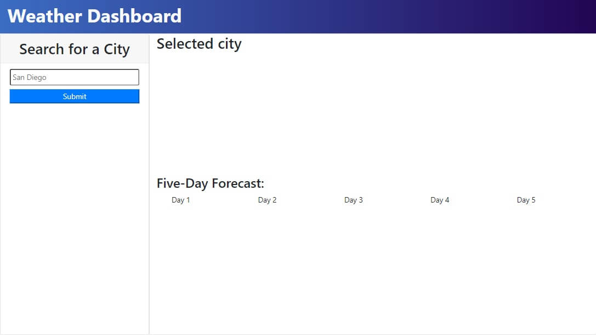

# Weather Dashboard

## Description

Enter any\* city and get its weather for today and the next five days.

## Features

A robust design includes search history, snappy results, and a future forecast.

## Installation

The site can be reached [here](https://axeljk.github.io/uw_m06_weather/)

## Credits

-Axel Kern, creator

## License

MIT license.